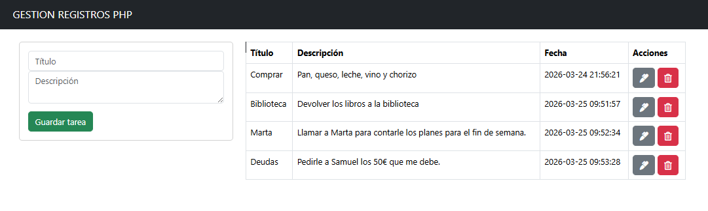
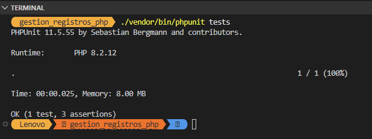

# GESTIÓN DE REGISTROS PHP 🚀

Este proyecto es un sistema dinámico para gestionar información en una base de datos MySQL, siguiendo el ciclo **CRUD** (Crear, Leer, Actualizar, Eliminar).

## 📸 Capturas del Sistema

*Descripción: Vista principal con la tabla de registros y formulario.*

*Descripción: Resultado exitoso de las pruebas unitarias de conexión.*

---

## 🛠️ Funcionalidades
* **Conexión Segura**: Establecimiento de canal activo con la base de datos.
* **Operaciones CRUD**: Recuperación, edición y eliminación de registros en tiempo real.
* **Garantía de Calidad**: Pruebas unitarias implementadas con **PHPUnit** para asegurar la robustez del código.

## 📥 Instalación
1. **Clona el repositorio** en tu servidor local (XAMPP/htdocs).
2. **Dependencias**: Ejecuta `composer install` para descargar PHPUnit y las herramientas necesarias.
3. **Base de Datos**: Importa el archivo SQL o crea la base de datos `gestion_registros_php`.
4. **Ejecución**: Abre `index.php` en tu navegador.

🚀 **¡Prueba el sistema y verifica los tests!**
